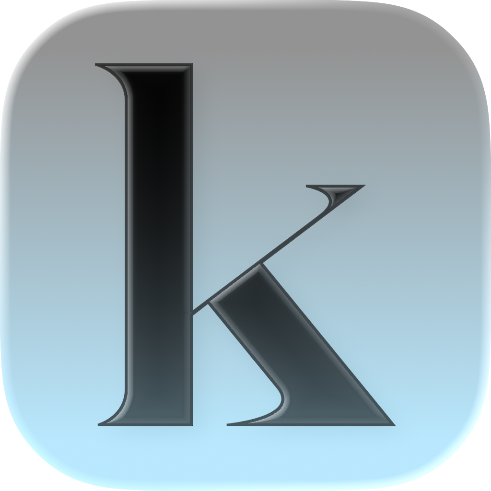

# keep

  
  
  **A new way to log your life**
  
  
  

---

## About keep

**keep** is your new way to log your life. Simply create a new diary entry and keep everything at one place.

##  Features

- **HomeView** - The control center of the entire app every infrmation that you need all in one place
- **CalendarView** - display your diary entrys 
- **Settings View** - personalize your app experience
- **Quick Add** - Add new entrys easily 
- **Modern UI** - we use the lqiuid glass from iOS to make our app look modern

## 🎨 Design

we use modern design components to make your experience as you know it from all the other apps

  
  &nbsp;&nbsp;&nbsp;
  
  &nbsp;&nbsp;&nbsp;
  

### Design-Prinzipien
- liquid glass
- use of icon composer

## 💻 Technologie-Stack

- **SwiftUI** - Modern UI Framwork
- **iOS SDK** - native iOS Development
- **Xcode** - IDE

## Comming Features

If you want to see what features we are planning for the future look here: [Github Projects](https://github.com/orgs/CodingWithSwift/projects/1)

---

  Made with ❤️ by Florian & Retikasd

